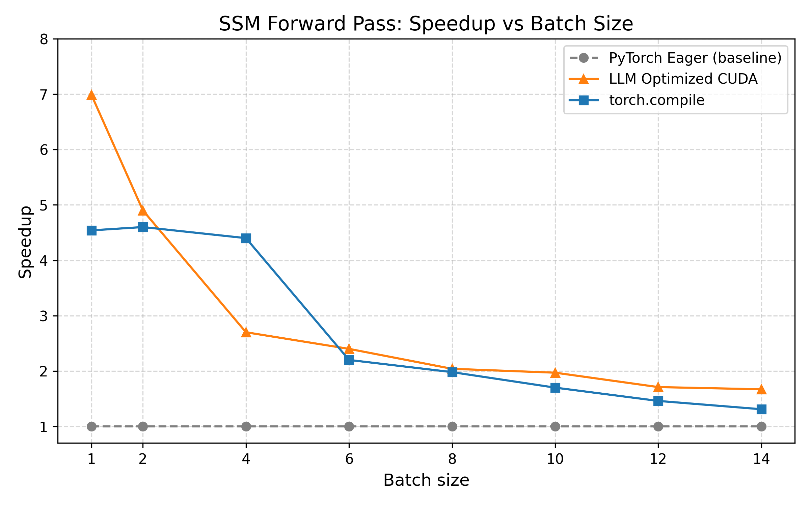
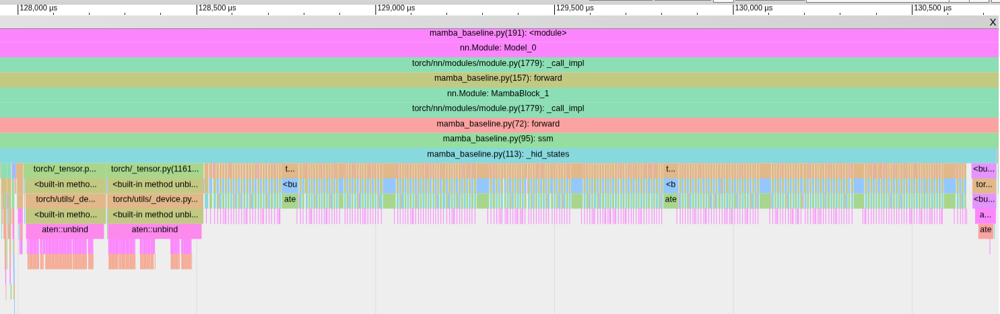
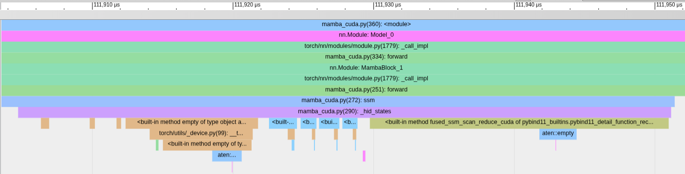

# Mamba Fusion Example: LLM-Optimized SSM Forward Pass

This repository provides a minimal, self-contained example showing how
**LLM-based compilation (LLM-assisted kernel generation)** can restructure
computation in ways traditional compilers typically cannot.
The goal is to clearly demonstrate how restructuring the computation of Mamba’s SSM forward pass can yield significant speedups.

It compares two implementations:

1. **PyTorch eager baseline**  
2. **LLM-optimized fused CUDA kernel** (adapted from [METR’s KernelBenchFiltered](https://github.com/METR/KernelBenchFiltered))  
3. `torch.compile` results are shown as an additional reference.

---

## 🔍 Background and Motivation

Traditional compilers specialize in graph-local optimizations—constant folding, operator fusion, memory planning—but they *rarely* transform a model into a fundamentally different computation.  
LLM-based optimizers don’t have that limitation: they can restructure the computation by understanding the underlying math.

The Mamba SSM forward pass is a perfect illustration: by changing *how* the computation is executed (not *what* is computed), a large speedup becomes possible.

---

## Project Structure

- `bench.py` — Main benchmarking script. Compares outputs between PyTorch eager, torch.compile, and the LLM-optimized CUDA implementation, checks correctness, and reports runtimes and speedups.
- `mamba_baseline.py` — Baseline PyTorch implementation of the Mamba SSM forward pass.  
- `mamba_cuda.py` — Optimized fused CUDA implementation generated via a specialized LLM-workflow, containing:
    1. `fused_rmsnorm_kernel`
    2. `fused_ssm_scan_reduce_kernel` ← **main performance gain**
    3. `fused_residual_add_kernel`


Among the three kernels, only **fused_ssm_scan_reduce_kernel** provides a substantial speedup; the others are standard fusions and have minimal impact.

### 🛠 What Was Modified From METR’s Version?

This project builds on the excellent fused Mamba kernels from  
https://github.com/METR/KernelBenchFiltered.  
The core logic is unchanged — credit goes fully to METR.  
Only light engineering adjustments were made so the kernels integrate cleanly in this repo.

## ⚡ Why the Fused Kernel Is So Much Faster

The baseline PyTorch implementation performs the SSM recurrence

``h[t] = A[t] * h[t-1] + X[t]``

followed by

``y[t] = ⟨h[t], C[t]⟩ + D * seq[t]``

—all across **L sequential timesteps**, with **separate GPU kernels**. In code, this is written as:

``torch.stack([h := A_t * h + X_t for A_t, X_t in zip(A, X)], dim=1)``

Here, `torch.stack` triggers synchronization and materializes all intermediate hidden states, adding to memory usage and GPU launch overhead.

The fused CUDA kernel takes a completely different approach:

- Fuses the recurrence **and** the dot-product reduction into one kernel  
- Streams through the sequence once — no repeated GPU launches  
- Keeps intermediate state in registers instead of writing `h` to memory  
- Avoids allocating or materializing the full hidden-state tensor  
- Removes the Python-level loop over L entirely

In short:

> **The entire SSM forward pass becomes a single fused sweep over the sequence — not L serial kernels with massive intermediate tensors.**

This is a **computation-level optimization**, not a hardware hack.  
Because the improvement comes from restructuring the computation itself, it’s **vendor-independent** and applies equally to NVIDIA, AMD, and others.

---

## 📊 Results: Runtime & Kernel Launch Comparison

Across batch sizes, the LLM-optimized code consistently outperforms both PyTorch eager and torch.compile, with the exception of batch size 4.



### 🔍 Eager vs. LLM-Optimized CUDA (Profiler Traces)
To understand *why* the fused kernel is faster, it’s helpful to look not only at wall-clock runtimes but also at the **Chrome trace** produced by the PyTorch profiler.

Below are Chrome trace screenshots for:

- PyTorch Eager Baseline
- LLM-Optimized Fused CUDA Kernel

Both traces are zoomed into the `_hid_states` section of the computation, which corresponds to the SSM recurrence:

$$h[t] = A[t] \cdot h[t-1] + X[t]$$

#### 🐢 Baseline (PyTorch Eager)

In the baseline trace, you can see **tons of tiny kernel launches**.  
This happens because the eager implementation evaluates the recurrence as a sequence of small ops, resulting in:

- Many small GPU kernel launches for the scan  
- Full materialization of the hidden-state tensor `(B, L, D, S)`  
- Poor GPU utilization due to launch overhead and small kernel sizes

This kernel-launch bottleneck dominates runtime for long sequences.



#### 🚀 LLM-Optimized CUDA (Fused Kernel)

In the optimized trace, the picture is totally different:

- Only a few kernels, with *one large kernel* performing the entire scan-reduce  
- No intermediate hidden-state tensor is ever materialized  
- High GPU occupancy inside a single fused pass  

The recurrence and the dot-product reduction are computed **inside registers**, not via Python loops or separate ops.

This structural rewrite is the source of the speedup.


---

#### 🧪 Reproducing the Profiler Traces

Both `mamba_baseline.py` and `mamba_cuda.py` already contain the code to generate Chrome traces:

```text
from torch.profiler import profile, ProfilerActivity

with profile(activities=[ProfilerActivity.CPU, ProfilerActivity.CUDA]) as p:
    model(x)

p.export_chrome_trace("trace_eager.json")   # or trace_cuda.json
```

Once exported, you can view the traces in Chrome:

1. Open Chrome and navigate to `chrome://tracing/`.
2. Click **“Load”** and select the `trace_eager.json` or `trace_cuda.json` file.


---

## Usage

```bash
# Create a conda environment
conda create -n mamba-fusion python=3.13 -y
conda activate mamba-fusion

# Install PyTorch with the correct CUDA version
pip3 install torch --index-url https://download.pytorch.org/whl/cu130

# Then install the rest
pip install -r requirements.txt
```

## Run the benchmark:
   ```bash
   python bench.py
   ```

This runs the baseline and optimized versions and shows their runtimes and speedups.

---


## 🙏 Acknowledgements / METR Credit

This project builds on the excellent fused Mamba kernels from 
[METR’s KernelBenchFiltered](https://github.com/METR/KernelBenchFiltered).  
The core kernel logic is unchanged — full credit goes to METR.

Minor engineering modifications were made to integrate the kernels smoothly:

- Cleaned up indexing and pointer arithmetic
- Added `__restrict__` and moved loop-invariant values out of inner loops
- Improved PyTorch wrapper for clearer shape handling and easier experimentation

The main performance gains come entirely from the LLM-driven **fused scan–reduce kernel**, not these minor adjustments.


## License

MIT
