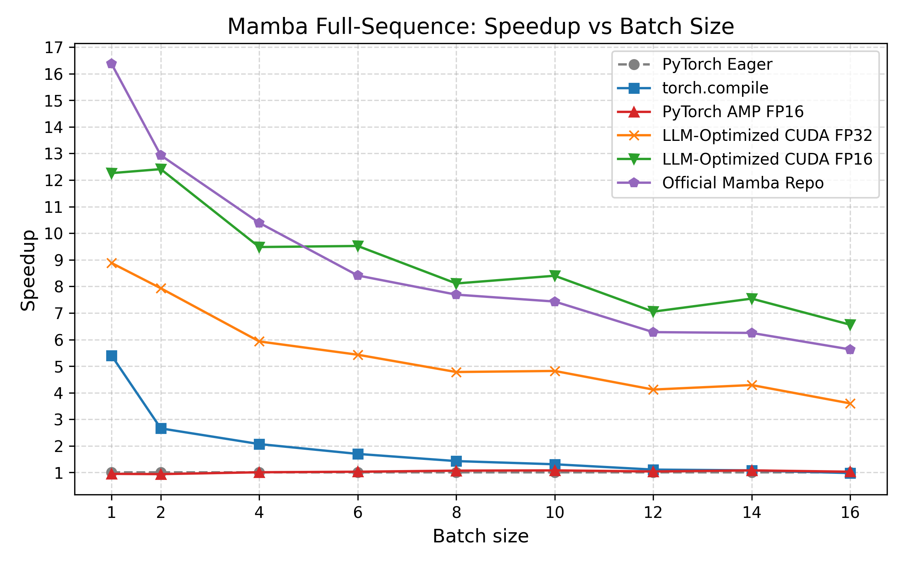
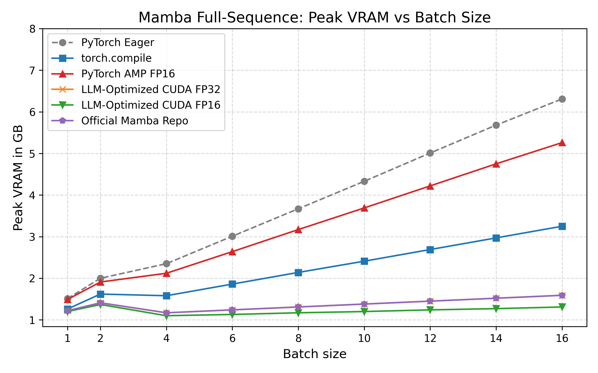

# Mamba Fusion Example: Fully Fused SSM Forward (FP32 & FP16)

This repository demonstrates how an LLM-assisted workflow can restructure the Mamba SSM full-sequence forward pass into a fully fused CUDA kernel — outperforming PyTorch eager and benchmarking directly against the official Mamba implementation.

What’s new compared to earlier versions:

- **Deeper fusion**: the kernel now fuses precompute + scan + reduce (not just scan-reduce).
- **Official-matching math**: the PyTorch baseline was adapted to match the official repo’s output.
- **Direct comparison vs official Mamba**: benchmarks include `state-spaces/mamba`.
- **Outdated profiling removed**: Nsight Compute + Chrome trace sections were dropped (not up-to-date).

---

## 🔍 What Changed

### 1) Deeper Fusion (Precompute + Scan + Reduce)

Earlier, the main optimization fused the scan + reduction step:

h[t] = A[t] * h[t-1] + X[t]

y[t] = ⟨h[t], C[t]⟩ + D * seq[t]


Now, the fused kernel performs significantly more work inside a single pass:

- Computes `delta = softplus(dt)` inside the kernel  
- Computes `exp(delta * A_param)` on the fly  
- Avoids materializing `A_bar`, `B_bar`, or `X_bar` tensors  
- Streams through the sequence once (no Python-level loop over `L`)  

This eliminates large intermediate tensors of shape `(B, L, D, S)`.

### 2) Official-Matching Baseline

The baseline PyTorch implementation was adapted to match the official Mamba math and output:

- Official repo: https://github.com/state-spaces/mamba  
- We copy weights from the official model into the baseline and CUDA models to ensure:
  - identical outputs
  - fair runtime comparisons
  - no “math drift” between implementations

---

## 📊 Results

Benchmarked at sequence length L = 512, d_state = 32, d_model = 1024, across batch sizes 1–16.

### Runtime Speedup (vs PyTorch Eager FP32)


The updated fused kernels are faster than before due to the deeper fusion of SSM precomputation and recurrence.



### Peak Memory Usage

Memory behaves very differently across implementations:

- PyTorch eager memory grows strongly with batch size  
- Fused CUDA and official Mamba show almost flat memory growth  

This happens because the fused scan computes the recurrence online and avoids materializing the large `(B × L × D × S)` intermediate tensors that dominate memory in the eager baseline.



---

## ⚡ Why the Fused Kernel Is Faster

The baseline PyTorch implementation evaluates the recurrence via Python-level sequencing:

```python
torch.stack([h := A_t * h + X_t for A_t, X_t in zip(A, X)], dim=1)
```

This causes:

- many small GPU kernel launches  
- full materialization of hidden states `(B, L, D, S)`  
- high memory traffic  

The fused CUDA kernel instead:

- streams through the sequence once  
- keeps hidden state in registers  
- fuses recurrence and reduction  
- avoids allocating `(B, L, D, S)` tensors  
- eliminates the Python loop over `L`  

In short: the entire SSM forward becomes a single fused sweep over the sequence.

---

## 📁 Project Structure

- `bench.py`  
  Main benchmarking script. Compares correctness, runtime, and peak VRAM across:
  - PyTorch eager
  - `torch.compile`
  - PyTorch AMP FP16
  - LLM-Optimized CUDA FP32
  - LLM-Optimized CUDA FP16
  - Official Mamba FP32

- `mamba_baseline.py`  
  PyTorch reference implementation adapted to match official Mamba output.

- `mamba_official.py`  
  Wrapper around the official `mamba_ssm` implementation used for correctness and runtime comparison.

- `mamba_cuda.py`  
  Optimized CUDA implementation built via `torch.utils.cpp_extension.load_inline`.  
  Exposes the following CUDA extension entry points:
  - `fused_rmsnorm_cuda`
  - `fused_residual_add_cuda`
  - `fused_ssm_scan_reduce_cuda` *(fallback path; consumes materialized A/X)*
  - `fused_ssm_precompute_scan_reduce_fp32_cuda` *(all-fused FP32 path)*
  - `fused_ssm_precompute_scan_reduce_fp16_cuda` *(all-fused FP16 path; includes specialized kernels, e.g. half2 for `d_state=32`)*

  Internally, these dispatch to multiple specialized CUDA kernels depending on dtype and state size.

---

## 🛠 Usage

### Environment Setup

```bash
conda create -n mamba-fusion python=3.13 -y
conda activate mamba-fusion

pip install torch --index-url https://download.pytorch.org/whl/cu130
pip install -r requirements.txt

# Install official Mamba
pip install mamba-ssm --no-build-isolation
```

### Run the benchmark:
   ```bash
   python bench.py
   ```
This runs the PyTorch eager baseline, torch.compile, AMP, and the LLM-Optimized fused CUDA
implementations (FP32 and FP16), checks correctness, and reports runtime and memory
metrics.


## 🙏 Acknowledgements / Kernel Origin

This project originally started from the fused SSM kernel in  
[METR’s KernelBenchFiltered](https://github.com/METR/KernelBenchFiltered).

However, the current implementation goes significantly beyond the original version:

- The kernel was extended to fuse additional computation (precompute + scan + reduce).
- A fully fused FP16 path was implemented (not present in the original).
- The math was aligned with the official Mamba implementation (`state-spaces/mamba`).
- Weight transfer logic was implemented to ensure exact output parity with the official repo.
- The surrounding PyTorch baseline was rewritten to match official Mamba numerics.

In other words, while the initial fused scan idea was inspired by METR’s kernel,
the current codebase substantially restructures, extends, and adapts it.

Credit goes to METR for the original fused scan concept —  
the deeper fusion, FP16 path, official alignment, and benchmarking framework were developed here.

## License

MIT

