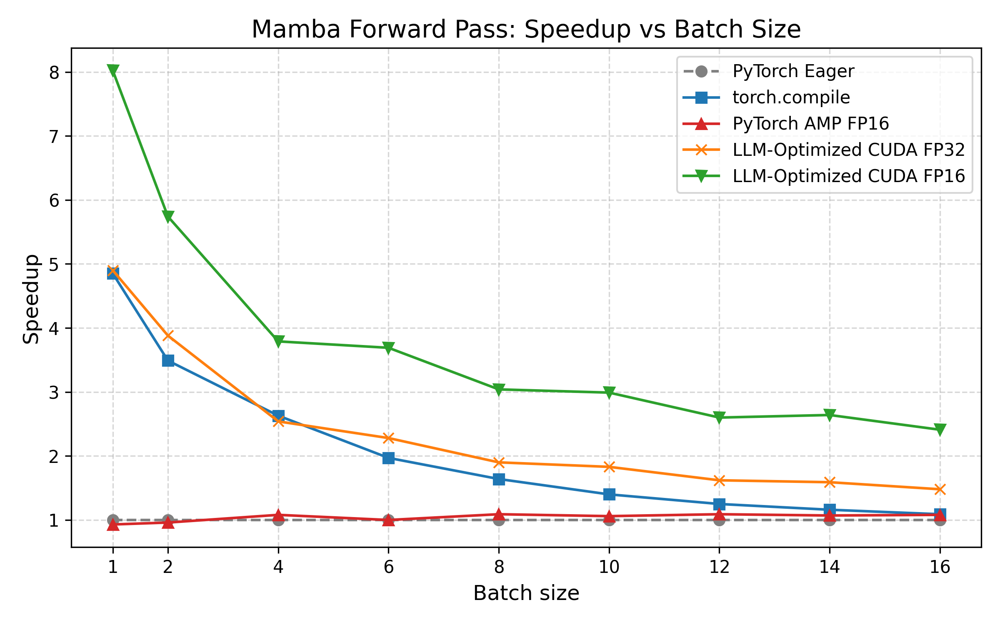
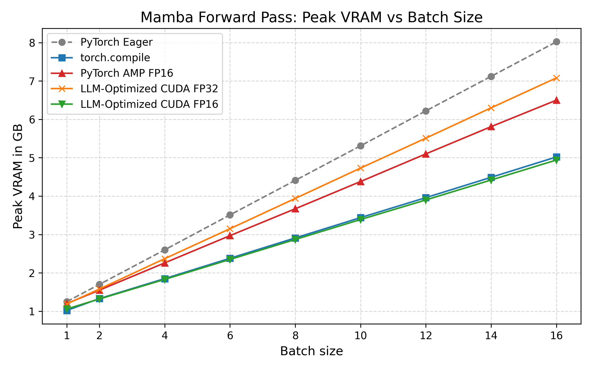
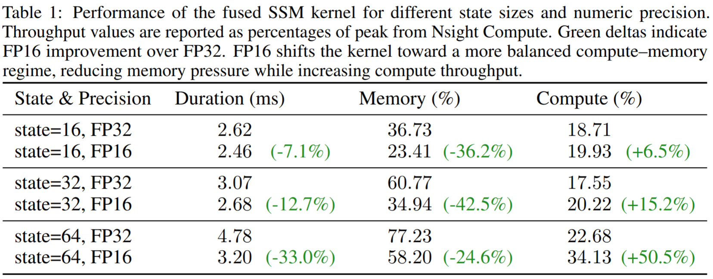

# Mamba Fusion Example: LLM-Optimized SSM Forward Pass (FP32 & FP16)

This repository provides a minimal, self-contained example showing how  
LLMs can restructure computation in ways traditional compilers typically cannot.

The project demonstrates two orthogonal ideas:

1. **Computation restructuring** of Mamba’s SSM forward pass into a single fused CUDA kernel  
2. **Numeric regime rewriting** from FP32 to FP16 on top of that fused kernel

Together, these yield substantial speed and memory improvements over standard PyTorch implementations.

---

## 🔍 Background and Motivation

Traditional compilers focus on graph-local optimizations such as operator fusion,
scheduling, or memory planning. They rarely rewrite a model into a fundamentally
different computation.

LLM-based workflows don’t have this limitation: they can reason about the math
and restructure the computation itself.

The Mamba SSM forward pass is a good example. By changing *how* the recurrence
is executed (not *what* is computed), a large speedup becomes possible — even
before changing numeric precision.

This repository first demonstrates that restructuring, and then shows how
pushing numeric precision from FP32 to FP16 further improves performance. FP16 numeric precision is widely used in AI 
models, as it typically preserves model quality while reducing memory traffic and increasing arithmetic intensity.

---

## Project Structure

- `bench.py`  
  Main benchmarking script.  
  Compares correctness, runtime, speedup, and peak VRAM across:
  - PyTorch eager
  - `torch.compile`
  - PyTorch AMP FP16
  - LLM-Optimized CUDA FP32
  - LLM-Optimized CUDA FP16


- `mamba_baseline.py`  
  Baseline PyTorch implementation of the Mamba SSM forward pass.

- `mamba_cuda.py`  
  Optimized CUDA implementation generated via an LLM-based workflow, containing:
  1. `fused_rmsnorm_kernel`
  2. `fused_ssm_scan_reduce_kernel` ← **main performance gain**
  3. `fused_residual_add_kernel`

Among these, only **`fused_ssm_scan_reduce_kernel`** provides a substantial
speedup; the others are standard fusions with minor impact.

---

## 📊 Results: Runtime & Kernel Launch Comparison

Across batch sizes 1–16, the LLM-Optimized CUDA FP16 version consistently outperforms eager, torch.compile, AMP, and the CUDA 
FP32 version. 


> Note: the speedup curves here use sequence length L=512; an earlier version used L=256, so absolute speedups are 
> slightly different (CUDA FP32 went from ~7× down to ~5×).


Lower precision also reduces memory pressure. Peak VRAM per forward pass drops significantly with CUDA FP16, enabling 
larger batches, longer sequences, or larger state sizes without running into OOM (see page 2 below).


Profiling the fused SSM kernel with Nsight Compute shows why FP16 helps: lower memory throughput, higher compute 
throughput, and shorter kernel duration. As the state size inside the SSM increases, arithmetic intensity rises and the 
FP16 advantage becomes even stronger (see page 3 below).



## Usage

### Environment setup
```bash
# Create a conda environment
conda create -n mamba-fusion python=3.13 -y
conda activate mamba-fusion

# Install PyTorch with the correct CUDA version
pip3 install torch --index-url https://download.pytorch.org/whl/cu130

# Then install the rest
pip install -r requirements.txt
```

### Run the benchmark:
   ```bash
   python bench.py
   ```

This runs the PyTorch eager baseline, torch.compile, AMP, and the LLM-Optimized fused CUDA
implementations (FP32 and FP16), checks correctness, and reports runtime and memory
metrics.

---

### 🔬 Profiling & Analysis

The fused SSM kernel can be profiled independently using Nsight Compute or
PyTorch’s built-in profilers.

#### Nsight Compute (kernel-level metrics)

To profile the fused scan–reduce kernel with Nsight Compute:

```bash
ncu \
  -k regex:fused_ssm_scan_reduce \
  --set basic \
  --replay-mode kernel \
  -c 1 \
  -o ssm_fp16 \
  python mamba_cuda.py --fp16
```
This generates an .ncu-rep file with kernel-level metrics such as memory
throughput, compute throughput, and kernel duration.
For FP32, just omit `--fp16`.

#### Chrome trace (timeline-level debugging)

To generate a Chrome trace for visualizing kernel launches and execution order:
```bash
python mamba_cuda.py --fp16 --profile torch
```
Open the trace in Chrome:

1. Navigate to `chrome://tracing`
2. Click **Load** and select the generated `.json` file

This view is useful for understanding kernel fusion, launch counts, and
serialization effects.


## ⚡ Why the Fused Kernel Is Faster

The baseline PyTorch implementation computes the SSM recurrence

``h[t] = A[t] * h[t-1] + X[t]``

followed by

``y[t] = ⟨h[t], C[t]⟩ + D * seq[t]``

across L sequential timesteps, with separate GPU kernels. In code, this is written as:

``torch.stack([h := A_t * h + X_t for A_t, X_t in zip(A, X)], dim=1)``

Here, `torch.stack` triggers synchronization and materializes all intermediate hidden states, adding to memory usage and GPU launch overhead.

The fused CUDA kernel takes a completely different approach:

- Fuses the recurrence **and** the dot-product reduction into one kernel  
- Streams through the sequence once — no repeated GPU launches  
- Keeps intermediate state in registers instead of writing `h` to memory  
- Avoids allocating or materializing the full hidden-state tensor  
- Removes the Python-level loop over L entirely

In short:

> **The entire SSM forward pass becomes a single fused sweep over the sequence — not L serial kernels with massive intermediate tensors.**

This is a computation-level optimization, not a hardware trick, and is
vendor-independent.

---


### 🔍 Eager vs. LLM-Optimized CUDA (Profiler Traces)
To understand *why* the fused kernel is faster, it’s helpful to look not only at wall-clock runtimes but also at the 
Chrome trace produced by the PyTorch profiler.

Below are Chrome trace screenshots for:

- PyTorch Eager Baseline
- LLM-Optimized Fused CUDA Kernel

Both traces are zoomed into the `_hid_states` section of the computation, which corresponds to the SSM recurrence:

$$h[t] = A[t] \cdot h[t-1] + X[t]$$

#### 🐢 Baseline (PyTorch Eager)

In the baseline trace, you can see **tons of tiny kernel launches**.  
This happens because the eager implementation evaluates the recurrence as a sequence of small ops, resulting in:

- Many small GPU kernel launches for the scan  
- Full materialization of the hidden-state tensor `(B, L, D, S)`  
- Poor GPU utilization due to launch overhead and small kernel sizes

This kernel-launch bottleneck dominates runtime for long sequences.


#### 🚀 LLM-Optimized CUDA (Fused Kernel)

In the optimized trace, the picture is totally different:

- Only a few kernels, with *one large kernel* performing the entire scan-reduce  
- No intermediate hidden-state tensor is ever materialized  
- High GPU occupancy inside a single fused pass  

The recurrence and the dot-product reduction are computed **inside registers**, not via Python loops or separate ops.

This structural rewrite is the source of the speedup.


---


## 🙏 Acknowledgements / Kernel Origin

This project builds on the excellent fused Mamba kernels from  
[METR’s KernelBenchFiltered](https://github.com/METR/KernelBenchFiltered).

The **core fused SSM kernel logic is unchanged** — full credit goes to METR.

This repository adds:
- Integration into a standalone, reproducible benchmark
- Cleaned-up PyTorch bindings for easier experimentation
- An FP16 variant of the fused kernel
- End-to-end benchmarking and profiling (runtime, memory, Nsight Compute)
- Minor engineering adjustments (e.g., indexing cleanup, `__restrict__` annotations, hoisting loop-invariant values); 


## License

MIT
